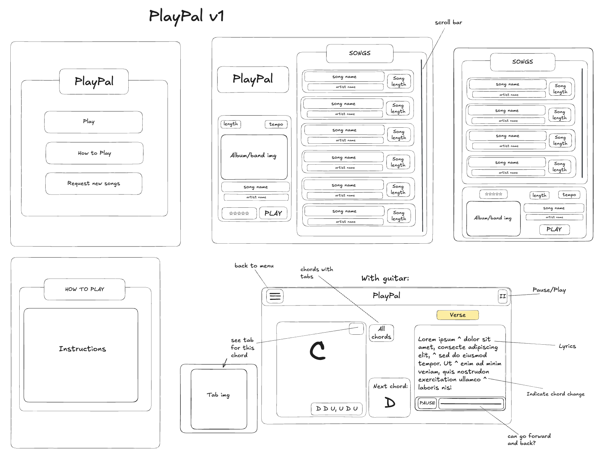

# PlayPal


PlayPal is a fun browser app where you can play along to songs on the guitar, with the chords and lyrics appearing on the screen in sync with the music.

I built this app to help make it easier to be more consistent with playing guitar. I have personally found that consistency is key when introducing a new habit and that it can often be a hassle to find all the information I need when re-visiting a previous song that I have learned. With Playpal, all of this information is in one place (chords, strumming pattern, lyrics and section patterns), making it easy to pick up where you left off!

### **Deployed:** https://playpal-guitar.netlify.app/

**Note:** If you are playing a song for the first time upon loading the app, the timings may be slightly off whilst the Heroku server wakes up - please refresh the page and re-select the song, second time's the charm!

## Features

#### Select a Song

- Browse the songs in the app and choose which one you'd like to play.
- Click on a song in the setlist to get more information, such as tempo, difficulty and chords used in the song.

#### Play Along

- Play along to songs on this page, where notes move along the fretboard and lyrics are highlighted in time with the song (karaoke-style).
- Once the note hits the orange line at the bottom of the fretboard, you should play the corresponding note on your guitar.

#### Library

- Browse the chords library, which includes diagrams to help with learning new chords. You can click on a chord to filter by songs that contain that specific chord.

## Installation and Setup

- Clone this repository and the separate server repo [here](https://github.com/isabellainglis/playpal-server)

- Install all the npm packages for both repos. Go into the project folder and type the following command to install all npm packages:

```bash
  npm install
```

- You will need to create the playpal database locally and populate using the database.sql file (/db/database.sql). **Note:** This project requires root details to be added in the `.env` file.

- Run npm start in both terminals

## Project Design

- I designed the app in a game-style so that it would be fun and interactive (similar to Guitar Hero).
- All data within the app comes from a self-built mySQL db. I created and populated the chords, lyrics and song details data using mySQL seeds, which can be found in my separate [server repo](https://github.com/isabellainglis/playpal-server).
- The library was an additional feature that I added to bring an educational aspect to the app.

**Original designs:**



## Challenges

Getting the timings right for the chords and lyrics on the screen was the biggest challenge I faced in this project. Originally I had used setintervals to change the positioning of the chords as they moved along the fretboard, however I eventually refactored this to instead use animation frames. This made the timings more dynamic and easier to adapt for different parts of the song.

I encountered a new hurdle when using the request animation frames - as this uses the computer's frame rate to run the animation, this meant that laptops/screens with a higher resolution (and therefore a higher FPS) would run the animation faster. To resolve this, I incorporated deltaTime, which meant that I could decouple the animation speed from the frame rate and ensure that the animation progressed consistently, regardless of the screen's refresh rate or resolution.

## Tech Stack

**Client:** React JS, Sass

**Server:** Node, Express, MySQL

**Packages**

- Axios
- dotenv

**Tools**

- Visual Studio Code
- Postman _(Testing API endpoints)_
- Figma _(UI Design)_

# Future Features

- I would love to add more songs to the app
- Incorporating songs that include picking rather than just strumming
- Chord recognition, to provide more of a game element with scoring and a leaderboard
- More filtering options in the Library page, i.e. being able to filter by mutliple chords.
